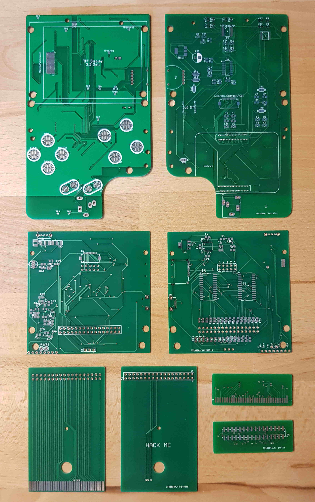

# PiHeld

This project is the first Raspberry Pi based handheld console to include a GameBoy cartridge reader.

So far the pcbs are still untested. Be a bit more patient of you want to use the pcbs ;).

## Preview

## Build guide

TODO: Here include all parts and how to build the system.

## Developer information

For Documentation check out [this](./doc/).

TODO: Here include information needed for developers.

# Further improvements (to-do list):

* Add a HDMI (or Mini-HDMI) Connector to the CM4 (on display-pcb) to give the user a Nintendo Switch like experience.
* Make a version compatible with the Raspberry Pi Zero, as it is cheaper and more commenly used.
* Make a version that fits in a GameBoy Color/Pocket shell. As those only have one pcb inside, the display and cartridge pcb could be combined to a single pcb. This would make the production part significantly easier.
* Make the USB-Charging port bidirectional. This enables users to connect e.g. a keyboard to the device (USB OTG).
* Update the software to enable users to interface with GameBoy Color cartridges.
* Theoretically GameBoy Advance cartridges could also be used with the system. Maybe some minor hardware modifications would be needed for this. Also the GBA cartridges do not fit in the GB/GBC/GBP cartridge slot.
* Make a custom OS-Image that already features the needed modifications for the hardware.
* Cartridge-pcb version with MCP23S17, as SPI is a lot faster than I²C.

## License

This project is completely open source, as we want everybody to be able to build their own EmbeddedBoy. Check out the `License.md` file to get further information on licensing. Since this project is open source, we would be happy if you want to support the project (see below).

## Split-off projects

* https://github.com/FelixWeichselgartner/Arduino_Logic_Analyzer
* https://github.com/FelixWeichselgartner/Adafruit_PowerBoost_SaveShutdown
* https://github.com/FelixWeichselgartner/RPi-I2C-LevelShifter
