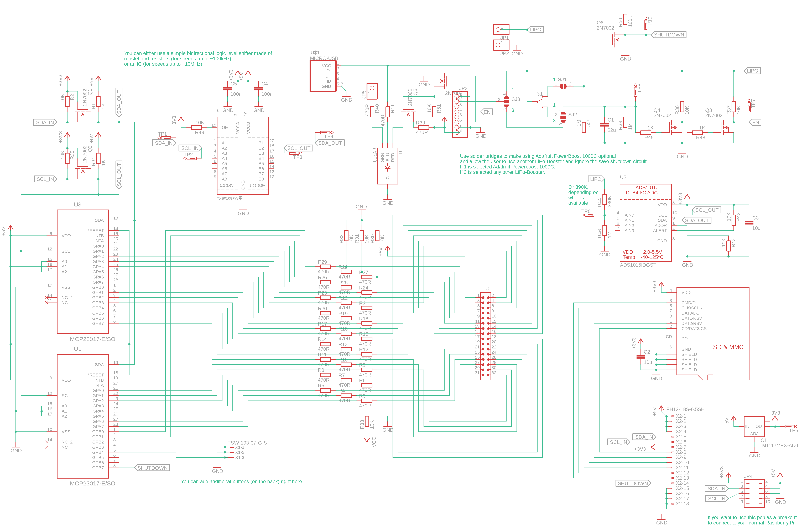

# Cartridge PCB

The cartridge pcb includes the following:
* Connectors
    * Micro USB Connector
    * SD-Card Connector
* Power Management
    * Power-Switch
    * RGB-Led (charging/low-battery/fully-charged)
    * LiPo connector
    * LiPo-BoostUp connector
* Cartridge dumper
    * 2x MCP23017 for cartridge
* Save shutdown circuit
* ADC for battery percentage
* optional IC for fast level shifting

### Schematic

### Layout

### Gerber Preview

### Breakout board for cartridge adapter to adjust height for gameboy shell

## License

Creative Commons Attribution-ShareAlike 4.0 International License (see `LICENSE` file).
